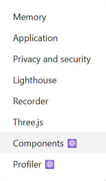

# 🧠 React Virtual Component boundary

> Komponen React yang powerful dan reusable untuk menjadi Error Boundary sekaligus wrapper modular. Cocok untuk menjaga kode React tetap rapi, aman, dan mudah digunakan ulang tanpa membuat banyak file kecil.

---

## Fitur Unggulan
-  ✅ Memecah Komponen Tanpa File Baru – bungkus bagian UI mana pun dengan MyComponent tanpa harus membuat file

- ✅ Error Boundary – mencegah crash pada aplikasi jika salah satu komponen anak mengalami error. Hanya bagian yang error yang menampilkan fallback UI.

- ✅ Wrapper modular – bungkus bagian UI mana pun agar kode tetap terorganisir dan mudah digunakan ulang.

- ✅ Mudah dikustomisasi – bisa menambahkan animasi, logging, styling, atau behavior lain di satu tempat.

- ✅ Siap untuk React + TypeScript – tipe aman dan mudah digunakan di proyek TypeScript.

- ✅ Ringan – tidak mempengaruhi performa aplikasi.

-  ✅ Ringan dan Aman – tidak mempengaruhi performa aplikasi, kompatibel dengan React dan TypeScript.

---

## Instalasi

Gunakan NPM:

```bash
npm i react-virtual-component-boundary
```
## Penggunaan Visual Component


Menampilkan status login pengguna
```
import React from "react";
import MyComponent from "react-virtual-component-boundary";

export const HeroSection = () => (
  <section className="flex gap-8">
    <MyComponent>
      <div >Konten Kiri</div>
    </MyComponent>

    <MyComponent>
      <div >Konten Kanan</div>
    </MyComponent>
  </section>
);


```
## Cek komponent yang di pecah 

Gunakan React Developer Tools Extension => inspect => sejajar dengan element, console pilih Components lalu cari component mudah


install extension https://chromewebstore.google.com/detail/react-developer-tools/fmkadmapgofadopljbjfkapdkoienihi

# react-virtual-component-boundary
